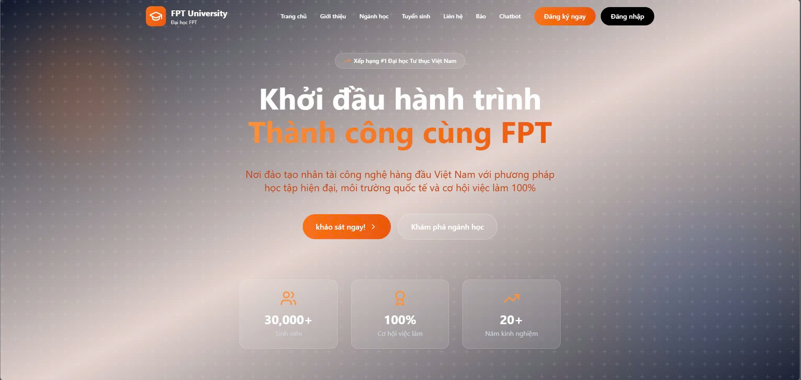

# FastAPI + LangChain + Qdrant + OpenAI

Dự án FastAPI tích hợp LangChain, Qdrant vector database và OpenAI API.

## Link video demo project: https://drive.google.com/file/d/1Y-9pc88Xo7CJwUd-GatL91TOUhyqgSh1/view


## Cài đặt

1. Tạo virtual environment:
```bash
python -m venv venv
source venv/bin/activate  # Linux/Mac
# hoặc
venv\Scripts\activate  # Windows
```

2. Cài đặt dependencies:
```bash
pip install -r requirements.txt
```

3. Cấu hình environment variables:
```bash
cp .env.example .env
# Chỉnh sửa file .env với API keys của bạn
```

4. Chạy Qdrant (sử dụng Docker):
```bash
docker run -p 6333:6333 qdrant/qdrant
```

## Chạy ứng dụng

```bash
python run.py
```

Hoặc:
```bash
uvicorn app.main:app --reload
```

API sẽ chạy tại: http://localhost:8000

API Documentation: http://localhost:8000/docs

## API Endpoints

### Chat
- `POST /api/chat/` - Chat với RAG (Retrieval-Augmented Generation)
- `POST /api/chat/simple` - Chat đơn giản không dùng RAG

### Documents
- `POST /api/documents/upload` - Upload một document
- `POST /api/documents/upload-batch` - Upload nhiều documents

## Visual Studio Code

Dự án đã được cấu hình sẵn cho VS Code:
- Python interpreter settings
- Debug configuration
- Format on save với Black
- Pytest integration
